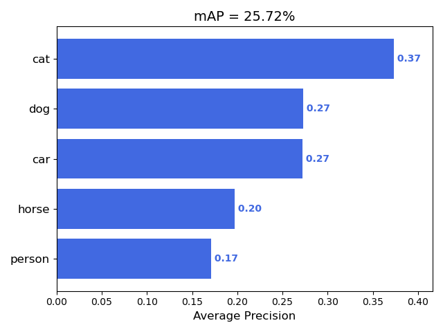
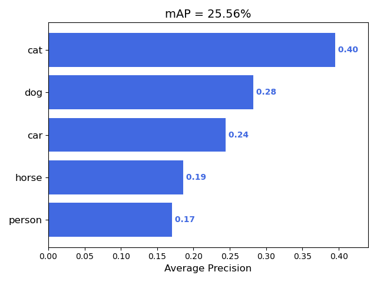

# CVFinalProject
For 《计算视觉理论、模型与方法》课程 Final Project

### Tips

Straight running from the terminal will likely not work, so I suggest you running our py files in an interactive environment like Python Console

### 1.Data set preparation

All images and annotations of voc2007 train/validation data should be placed under voc2007/imgwithannot, and all images and annotations of voc2007 test data should be placed under test/voc2007/imgwithannot.

And you can create a custom dataset by modifying the element of class_new in data_split.py and executing each function.

### 2.Train

You can calculate std and mean by running cal_stdmean.py.

You can run the training by setting the backbone, file path, lr, etc. within the train.py file and running it.

### 3.Test

After completing the training, or after downloading the already trained model file provided below, put it in the logs folder, and run the test.py file to run the test. Running the test.py file stores the model's predictions in input/detection-results, and you can run mAP.py to calculate the mAP.

### 4.Detect Image

You can run detect.py to detect objects on the image. Three example images are provided in our repo, and are stored in data/example/. If you want to use a different images, you can edit the img_path of the detect.py file.

### Results

| Backbone     |  mAP    |  trained model    |   Access code   |
|:------------:|:-------:|:-----------------:|:---------------:| 
|ResNet-18     | 25.72    |   [centernet_res18.pth](https://pan.baidu.com/s/1fyNGoC5LOYQ4tLQj8Hw48Q)  |  dv7p  | 
|ResNet-50     | 25.56    |   [centernet_res50.pth](https://pan.baidu.com/s/1O_Ono6YBziLo5MgjAZQvNA)  |  mt7b  | 

##### mAP of Centernet with ResNet-18 
 

##### mAP of Centernet with ResNet-50 
 

### Requirements
>
* Python >= 3.6
* PyTorch >= 1.7
* torchvision that matches the PyTorch installation.
* PIL
* matplotlib
* tqdm
* numpy
* imgaug

### Adapted from: 
+ https://github.com/xingyizhou/CenterNet
+ https://github.com/Cartucho/mAP  
